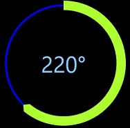

# WPF_Circular-Progress-Bar
Circular progress bar created in WPF


.... or with settings
 
 ```
  <cpb:CircularProgressBar
            Thickness="15" Radius="100"
            Background="GreenYellow"
            Fill="Transparent"
            Stroke="Blue"
            StrokeThickness="3"
            StrokeMode="Middle"
            EndLineCap="Triangle"
 ```



